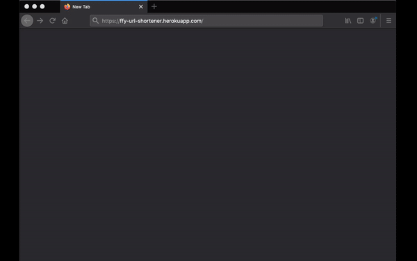

## my-simple-url-shortener
A simple URL shortener I built with with express, bootstrap, mongoDB, and some other packages (detailed list on github).  

The app is deployed on heroku([Link](https://ffy-url-shortener.herokuapp.com/)).   

Since this is just a project, the URL is not actually shortened so much because I did not buy a custom short domain, I just used the domain that comes with heroku, which is pretty long.  

 The inspiration is that sometimes when I share youtube videos with my friends, the auto-generated link is not the same as what's been showing in the address bar. So I want to know why different URLs can link to the same website. And I want to build my own URL shortner and see if it works.
 

## Features
* URL shortener
* List of all previously shortened URLs
* Input URL validation
* Short URL validation
 
## How to use
Go to [Website deployed on heroku](https://ffy-url-shortener.herokuapp.com/)

**Demo**  

## My understandings of URL shortener
From my understanding of URL shortener, the way it works is that when a
        user enter a URL that is to be shortened, we send it to our database and
        automatically generate a corresponding unique key, which is going to be
        shortened URL, and store them together in our database. Then when a user
        accesses a shortened URL, we find the corresponding original URL in our
        database and redirect the user to it. 

## Some more features I might add
* Copy button

## Other infomations
Since this is just a simple project, all shortened URLs only works for 10 minutes after generated, then they will be deleted.    

